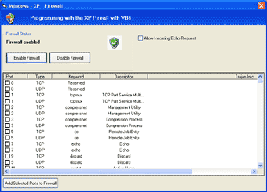



## Programming with the WinXP firewall

### Description

This code teachs you how to change WinXPSP2 Firewall settings via the hnetcfg.dll with VB6.

You can

1) Enable and disable the Firewall

2) Select Ports from a large Portlist (with description and trojan info) and add them to the Windows Firewall Settings

3) Allow and Disallow incomming ICMP requests

NOTE: you need WinXPSP2 to run this code.

References to NetCon 1.0 Type Library and Microsoft Scripting Runtime

Download this code and much more VB6, VB.NET and C# Code from my Website www.visualsoft-net.de
 
### More Info
 

             |
---                |---
**Submitted On**   |2004-11-11 08:53:06
**By**             |[Mähr Stefan](https://github.com/Planet-Source-Code/PSCIndex/blob/master/ByAuthor/m-hr-stefan.md)
**Level**          |Advanced
**User Rating**    |4.8 (29 globes from 6 users)
**Compatibility**  |VB 6\.0
**Category**       |[Windows System Services](https://github.com/Planet-Source-Code/PSCIndex/blob/master/ByCategory/windows-system-services__1-35.md)
**World**          |[Visual Basic](https://github.com/Planet-Source-Code/PSCIndex/blob/master/ByWorld/visual-basic.md)
**Archive File**   |[Programmin18171611112004\.zip](https://github.com/Planet-Source-Code/m-hr-stefan-programming-with-the-winxp-firewall__1-57199/archive/master.zip)

